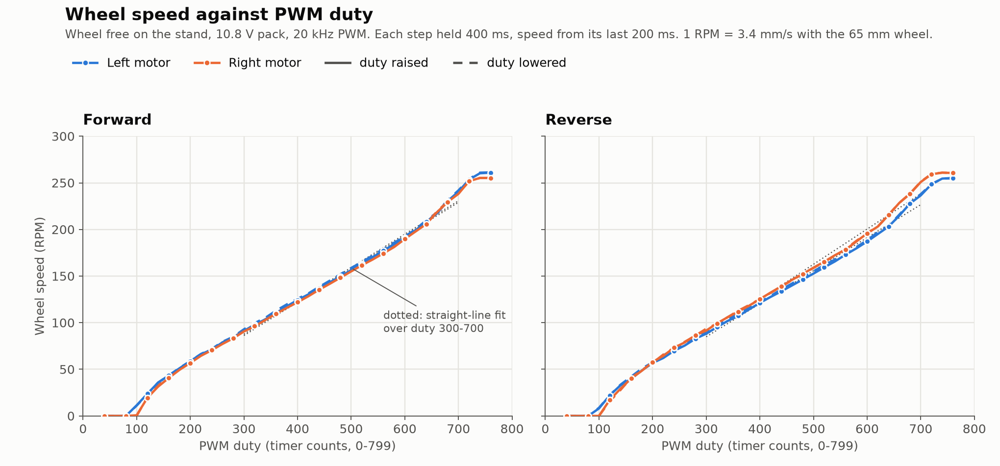
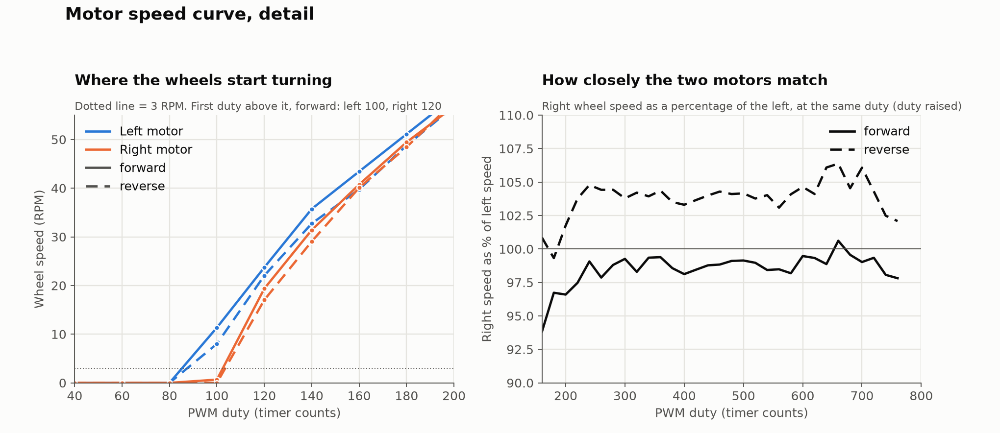

# motors

Two HW-039 / IBT_2 (BTS7960) drivers, register-level PWM. Code:
`src/hal/motors.{h,cpp}`, pure duty split in `include/MotorDrive.h`. Decision:
[0002](../decisions/0002-drive-and-sensing-hardware-allocation.md).

## Interface

- `motorsInit()` - all pins low, EN low (coast), timers running at duty 0. Does
  not enable the drivers.
- `motorsEnable(bool)` - EN pins. Low = both half-bridges off (coast) and both
  commands zeroed, so a later enable starts from rest.
- `motorSet(Motor, int16_t)` - signed duty in timer counts, clamped to
  +-`MOTOR_PWM_TOP` (799). `> 0` is forward after `MOTOR_*_INVERT`.

## How it works

Left on Timer4 (OC4A = RPWM D6, OC4B = LPWM D7, EN D8), right on Timer1 (OC1A =
RPWM D11, OC1B = LPWM D12, EN D10). Fast PWM mode 14, `ICRn` = 799, clk/1 =
20 kHz. Positive command PWMs RPWM with LPWM low; negative does the reverse. The
leg at zero is disconnected from its timer and held low, so duty 0 is a true
constant low.

From the BTS7960 truth table, with EN high a command of 0 should brake (both
low-side FETs on) and EN low should coast. Not yet confirmed on hardware.

## Invariants

- Reversing is a change of which leg carries PWM; no direction pin is sequenced.
  Reversal under load has not been characterised, so ramp command changes in
  the control layer rather than flipping full-speed.
- Duty units are timer counts. `MOTOR_MIN_PWM_L/R` must be measured at 20 kHz.
- Nothing enables the drivers at boot; the control layer owns `motorsEnable`.

## Status

Compiles; the duty split is covered by `test/test_motor_drive` on the host.
`motorSet` / `motorsEnable` are not called by anything yet and have not been
run on hardware. Bring-up: check the boards' EN pins have a pull-down (else add
one, since the Mega pins float during reset); with EN high, step one motor
0 -> +100 -> 0 -> -100 and confirm direction and that the other leg stays low on
a scope or meter; set `MOTOR_*_INVERT` so positive is forward; then measure the
dead zone.

## Measured speed curve

Data: [`motor-speed-curve.csv`](../../calibration/motor-speed-curve.csv); redraw with
`scripts/plot-motor-curve.py` (needs matplotlib). Wheel free on the stand, 10.8 V pack,
duty stepped 40 to 760 and back in steps of 20, each held 400 ms, speed from the last
200 ms.

- Both motors turn from duty ~100 (left) and ~120 (right), in both directions; lowering
  the duty again stops them at the same point, so no hysteresis shows at this step size.
- Linear from ~300 to ~700: about 0.36 RPM per duty count, 3.4 mm/s per RPM with the 65 mm
  wheel. Top speed is 255-261 RPM at 760.
- The two motors match closely: the right turns 1-2% slower than the left forward and
  3-5% faster in reverse, over duty 200-760.
- On the floor, from rest, the right wheel turned 5-20% fewer counts than the left at the
  same duty (300-380), and starting it from rest needed more duty (~250 forward) than
  the stand's rolling threshold. That load difference is not in this curve; the wheel
  balance in [safe_run](safe_run.md) compensates for it.
