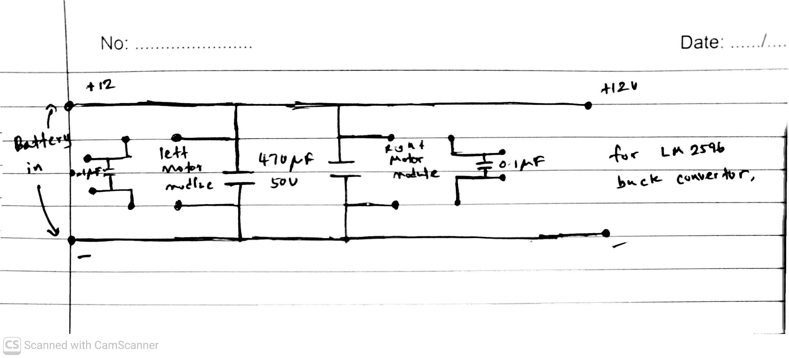

# Power Distribution and Battery Selection Design

This document outlines the power circuit architecture, load analysis, and electrical engineering justifications for the battery selection in our maze-solving robot. The system is designed to prioritize absolute electrical stability, sensor accuracy, and zero voltage sag during high-torque maneuvers.

## 1. Power Circuit Architecture

The robot utilizes a split-bus power architecture to isolate sensitive 5V logic components from the electrical noise generated by the drive motors. 

* **Main Power Bus:** A 12V bus distributes power directly from the battery to the two IBT-2 motor driver modules and the LM2596 buck converter.
* **Logic Power (5V Rail):** An LM2596 buck converter steps the 12V bus down to a stable 5V to power the Arduino Mega 2560, IR sensor array, MPU-6050 gyroscope, and 3× HC-SR04 ultrasonic sensors.
* **Noise Filtering & Decoupling:** 
  * Two **470uF, 50V electrolytic capacitors** are placed on the power inputs of each motor module to act as local bulk energy storage, smoothing out sudden current spikes during motor startup.
  * **104 (0.1uF) ceramic capacitors** are soldered directly across the terminals of the JGA25-370 motors to suppress high-frequency electromagnetic interference (EMI) and brush arcing.

---

## 2. System Load Analysis

To size the battery and wiring correctly, we calculated the typical operating loads versus the absolute peak (stall) loads using datasheet values for our hardware components.

| Component | Quantity | Rated Current (Typical) | Maximum / Stall Current (Peak) |
| :--- | :---: | :--- | :--- |
| **JGA25-370 DC Motor (12V)** | 2 | ~0.30A (0.60A total) | ~1.50A (3.00A total) |
| **IBT-2 Motor Driver (Logic)** | 2 | ~0.01A (0.02A total) | ~0.02A (0.04A total) |
| **Arduino Mega 2560** | 1 | ~0.08A | ~0.15A |
| **IR Sensor Array** | 1 | ~0.10A | ~0.15A |
| **Ultrasonic Sensor (HC-SR04)**| 3 | 0.015A (0.045A total)| 0.02A (0.06A total) |
| **Gyroscope (MPU-6050)** | 1 | ~0.004A | ~0.005A |
| **Total Expected Draw** | - | **~0.85A** | **~3.40A** |

### Design Margin (The 5A Rating)
In maze-solving applications, motors frequently reverse direction and accelerate from a standstill. During these transients, both motors can simultaneously hit their maximum stall current. Applying an engineering safety factor of ~1.47 to our 3.4A peak load establishes our **5.0A system rating**. All wires, traces, and connectors on the 12V bus are rated to handle a minimum of 5A continuously.

---

## 3. Battery Selection: Capacity Verification

The competition consists of 3 rounds, lasting a maximum of 8 minutes each.
* **Total Competition Time:** 3 rounds × 8 mins = 24 minutes (0.4 hours)
* **Average Current Draw:** ~0.85A
* **Absolute Minimum Capacity for Competition:** 0.85A × 0.4h = **340 mAh**

However, competition day requires extensive practice runs, motor calibration, and test mazes without the opportunity to recharge. Factoring in 1.5 to 2 hours of active testing plus a safe LiPo discharge buffer (preventing cell drops below 3.2V), our minimum practical capacity is well over 1000 mAh. 

Based on this, we selected a **3S (11.1V), 2200mAh, 45C LiPo battery**. 

---

## 4. Engineering Justifications for the 2200mAh 45C LiPo

While a 2200mAh battery carries a slight weight penalty compared to micro-batteries, we intentionally selected it based on the following electrical engineering principles:

### A. Off-The-Shelf (COTS) Availability
The 3S 2200mAh format is a standard, mass-produced specification. Choosing this form factor avoided the high costs and procurement delays of niche small-form-factor packs, ensuring cost efficiency and immediate availability of spares.

### B. Ultra-Low Internal Resistance ($R_{int}$) and Negligible Voltage Sag
The most critical parameter during transient motor switching is the battery's internal resistance. A 2200mAh 45C pack typically has an internal resistance of only $10\text{ m}\Omega \text{ to } 18\text{ m}\Omega$. 

When both motors stall or reverse direction simultaneously ($\Delta I \approx 3.5\text{A}$):
$$\Delta V_{sag} = \Delta I \times R_{int}$$
$$\Delta V_{sag} \approx 3.5\text{A} \times 0.015\Omega = \mathbf{0.052\text{V}}$$

The voltage sag is a negligible **~52mV**. The battery acts as an ideal, stiff voltage source, preventing the 12V bus from sagging and eliminating the risk of microcontroller brownouts. 

### C. Motor Consistency & Flat Discharge Plateau
At our low continuous draw ($0.85\text{A}$ on a $2.2\text{Ah}$ pack is a discharge rate of only **$0.38\text{C}$**), the LiPo discharge curve is virtually horizontal. The 12V bus stays locked between 11.1V and 12.0V across all competition rounds. This provides the motors with a highly consistent voltage-to-RPM response, which is crucial for accurate encoder dead-reckoning and PID tuning.

### D. Extreme Peak Current Overhead
To ensure absolute safety and stability, the battery must supply the stall current instantly:
* **System Maximum Peak Current:** ~3.5A
* **Battery Maximum Discharge Current:** $2.2\text{Ah} \times 45\text{C} = \mathbf{99\text{ Amps}}$

The battery's 99A continuous discharge capability vastly outpaces the 3.5A system requirement.

### E. Input Stability for the LM2596 Buck Converter
Sharp input voltage drops force switching regulators to rapidly adjust their duty cycle, which can generate ripple. Keeping the 12V input bus rock-solid (due to the low $R_{int}$) guarantees that the LM2596 produces a perfectly clean 5V output, protecting sensitive analog signals on the MPU-6050 and HC-SR04 sensors from motor-induced electrical noise.

---

## 5. Physical Circuit Implementation

